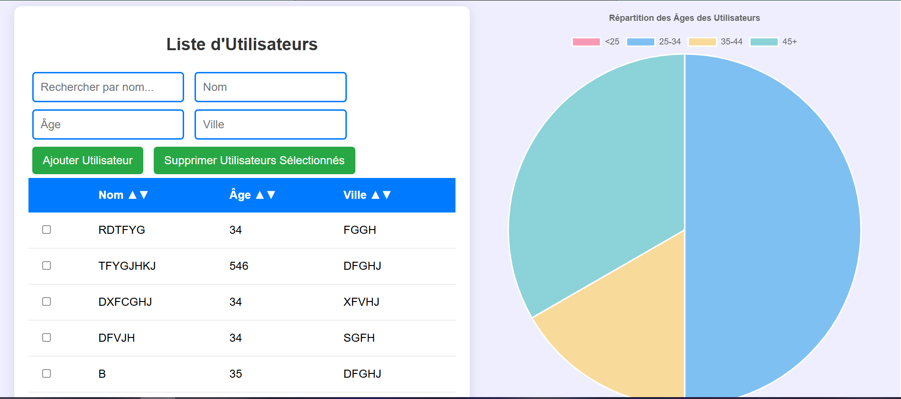
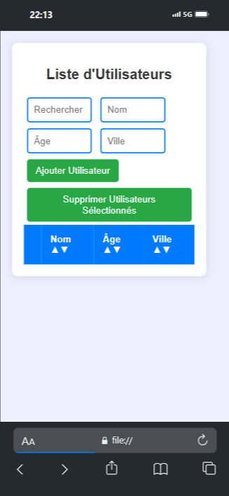

# Projet de Connexion et Graphique Utilisateur

Ce projet est une page de connexion simple qui permet à l'utilisateur de se connecter et d'accéder à un tableau de bord contenant un graphique généré avec **Chart.js**. Le projet est fait en **HTML**, **CSS**, et **JavaScript pur**.

## Fonctionnalités

- **Page de Connexion** : L'utilisateur peut se connecter en entrant un nom d'utilisateur et un mot de passe.
- **Validation des identifiants** : Les identifiants sont vérifiés localement dans le code JavaScript (simulation d'un tableau d'utilisateurs).
- **Graphique Utilisateur** : Après une connexion réussie, l'utilisateur est redirigé vers une page contenant un graphique représentant l'activité de l'utilisateur (exemple avec **Chart.js**).
- **Message d'erreur** : Si les identifiants sont incorrects, un message d'erreur est affiché.

## Technologies utilisées

- **HTML** : Structure de la page de connexion et du tableau de bord.
- **CSS** : Mise en page et style des éléments sur les pages de connexion et du tableau de bord.
- **JavaScript** : Validation des informations de connexion et génération du graphique dynamique.
- **Chart.js** : Bibliothèque JavaScript utilisée pour générer et afficher le graphique.

## Installation

### Prérequis
- Aucun, le projet est conçu pour être exécuté sur un simple serveur local ou en ouvrant les fichiers directement dans un navigateur.

### Étapes

1. Clonez ou téléchargez ce projet.
2. Ouvrez le fichier `index.html` dans votre navigateur pour afficher la page de connexion.
3. Entrez l'un des identifiants d'utilisateur définis dans le fichier `script.js` pour accéder au tableau de bord.

## Structure du Projet
/mon-projet ├── index.html # Page contenant le graphique  ├── Dpage de connexion.html # Page de connexion├── styles.css # Fichier CSS pour la mise en page ├── script.js # JavaScript pour la validation et la gestion des utilisateurs


## Détails sur le Code

### Fichier `index.html`
Ce fichier contient un graphique généré avec **Chart.js**. Un graphique simple représentant l'activité de l'utilisateur est tracé à partir de données simulées.



### Fichier `styles.css`
Ce fichier CSS définit le style de la page de connexion et de la page du tableau de bord. Il inclut des règles de mise en page pour centrer le formulaire de connexion et le bouton, et pour styliser le graphique sur le tableau de bord.

### Fichier `script.js`
Le fichier JavaScript contient un tableau simulant les utilisateurs avec leurs informations de connexion. La fonction `validateLogin` vérifie si l'utilisateur existe et si le mot de passe est correct. Si c'est le cas, l'utilisateur est redirigé vers la page contenant le graphique. Sinon, un message d'erreur est affiché.

### Fichier `PAGE DE CONNEXION.html`
Ce fichier contient le formulaire de connexion avec deux champs : **Nom d'utilisateur** et **Mot de passe**. Le formulaire utilise JavaScript pour valider les informations d'identification avant de rediriger l'utilisateur vers le tableau de bord.


## Ajouter de Nouveaux Utilisateurs

Dans le fichier `script.js`, vous pouvez ajouter de nouveaux utilisateurs au tableau `users`. Par exemple :

```javascript
const users = [
    {
        username: "utilisateur1",
        password: "motdepasse1"
    },
    {
        username: "utilisateur2",
        password: "motdepasse2"
    }
];

```


## Améliorations à venir

- **Authentification sécurisée** : Implémenter une base de données et un backend pour une gestion plus sécurisée des utilisateurs.
- **Tableau de bord dynamique** : Ajouter des données réelles pour le graphique (ex. données d'activité utilisateur en temps réel).
- **Design responsive** : Adapter le design pour les mobiles et tablettes.



## Contributeurs

Les contributions sont les bienvenues ! Si vous avez des suggestions ou des améliorations à proposer, ouvrez une pull request ou soumettez un issue.

## Auteurs

- **CHERUBIN MANUNGA** - Créateur du projet

## Licence

Ce projet est sous licence [MIT](https://opensource.org/licenses/MIT).

